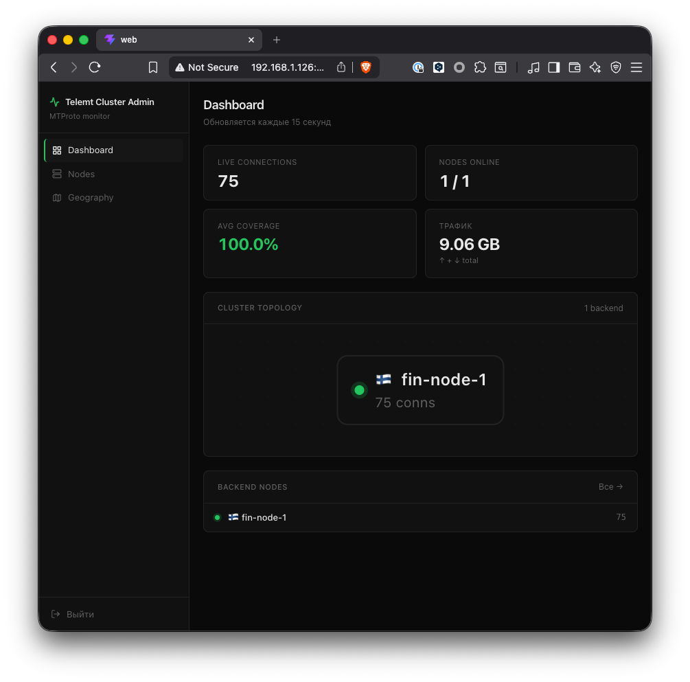
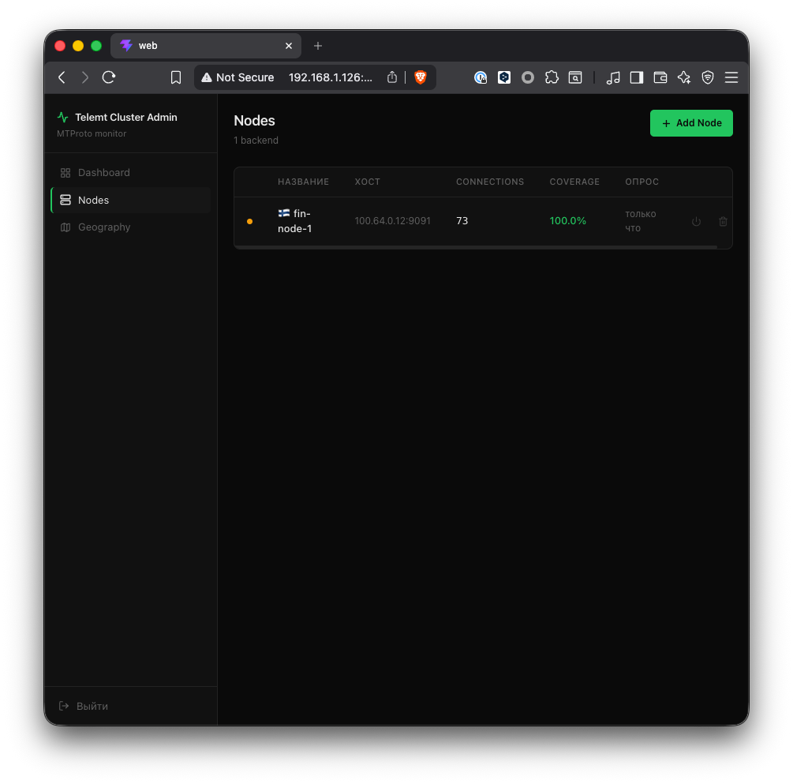
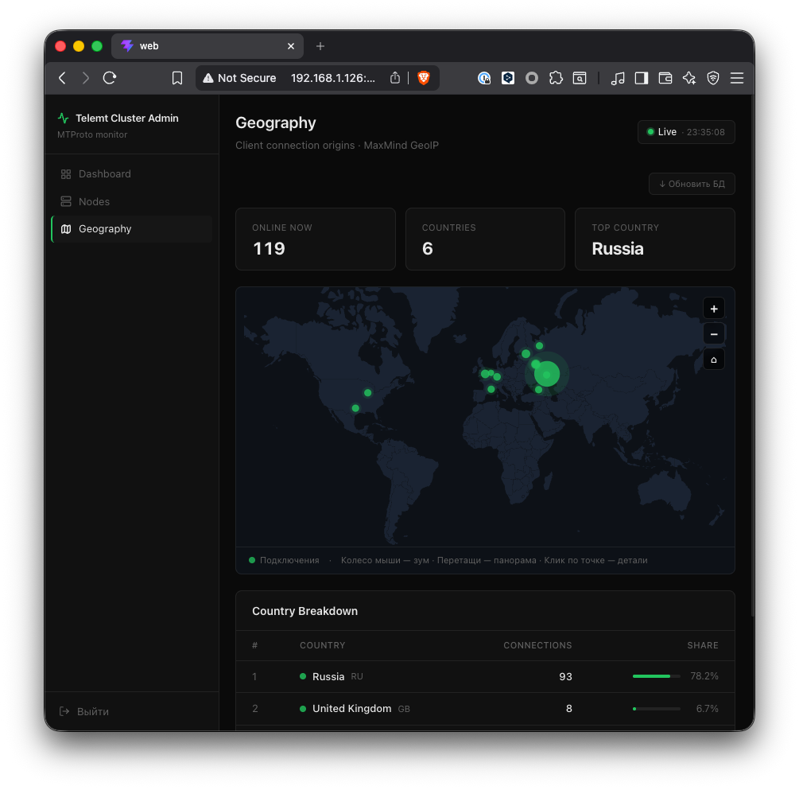

# Proxy admin

<p>
  <a href="#english">English</a> · <a href="#русский">Русский</a>
</p>

---

<h2 id="english">English</h2>

> Admin panel for [telemt](https://github.com/telemt/telemt) MTProto proxy clusters

Monitor nodes, track live connections, visualize client geography — deployed in one command.

### Screenshots

| Dashboard | Nodes | Geography |
|---|---|---|
|  |  |  |

### Features

- **Live dashboard** — connections, ME coverage %, throughput across all nodes
- **Node management** — add/remove telemt backend nodes and HAProxy entry nodes
- **Topology view** — cluster graph: entry points → backend nodes with real-time status
- **Geography map** — interactive world map showing live client origins (MaxMind GeoIP2)
- **Metrics history** — 48h time-series charts per node
- **Auth** — optional login/password via env vars
- **Responsive** — works on desktop and mobile

### Quick start

```bash
git clone https://github.com/yourname/telemt-cluster-admin
cd telemt-cluster-admin

cp .env.example .env
# edit .env — set ADMIN_PASSWORD and optionally MAXMIND_LICENSE_KEY

docker compose up -d
```

Open **http://localhost:3000**

### Configuration

```env
PORT=3000                    # panel port
POLL_INTERVAL=15s            # how often to poll nodes

# Cluster mode:
#   simple — telemt backend nodes only (no HAProxy)
#   full   — telemt + HAProxy entry nodes (default)
CLUSTER_MODE=full

# Auth — leave ADMIN_PASSWORD empty to disable (good for VPN/private nets)
ADMIN_USER=admin
ADMIN_PASSWORD=

# GeoIP — get a free key at maxmind.com/en/geolite2/signup
# DB (~60 MB) auto-downloads on first start, updates weekly
MAXMIND_LICENSE_KEY=
```

### Adding nodes

**Nodes → Add Node → Backend (telemt)**

| Field | Value |
|---|---|
| Hostname / IP | your telemt server |
| Port | `9091` (default) |

Requires port `9091` open from the panel host:
```bash
ufw allow from <PANEL_IP> to any port 9091
```

**Nodes → Add Node → Entry (HAProxy)** *(only in `full` mode)*

| Field | Value |
|---|---|
| Hostname / IP | your HAProxy server |
| Stats port | `8404` |

Requires HAProxy stats to be accessible externally:
```haproxy
# haproxy.cfg
listen stats
    bind 0.0.0.0:8404
    stats enable
    stats uri /stats
```
```bash
ufw allow from <PANEL_IP> to any port 8404
```

### Data storage

SQLite and GeoIP files live in `./data/` (Docker volume, persisted between restarts):

```
data/
├── cluster.db          # nodes, metrics, geo snapshots
└── GeoLite2-City.mmdb  # MaxMind GeoIP (auto-downloaded if key is set)
```

Metric history is kept for **48 hours**, then auto-purged.

### Development

```bash
# Backend
mkdir -p data && go run .

# Frontend (separate terminal)
cd web && npm install && npm run dev
# → http://localhost:5173 (proxies API to :3000)
```

### Stack

Go · Gin · SQLite · React 19 · TypeScript · Vite 8 · Recharts · d3-geo · Docker

---

<h2 id="русский">Русский</h2>

> Панель администрирования кластеров [telemt](https://github.com/telemt/telemt) MTProto прокси

Мониторинг нод, живые подключения, география клиентов — запускается одной командой.

### Скриншоты

| Дашборд | Ноды | География |
|---|---|---|
|  |  |  |

### Возможности

- **Дашборд** — подключения, покрытие ME, трафик по всем нодам
- **Управление нодами** — добавление/удаление telemt backend и HAProxy entry нод
- **Топология** — граф кластера: точки входа → backend ноды с live-статусом
- **Карта географии** — интерактивная карта мира с источниками подключений (MaxMind GeoIP2)
- **История метрик** — графики за 48ч по каждой ноде
- **Авторизация** — опциональный логин/пароль через env-переменные
- **Адаптивный дизайн** — работает на десктопе и мобильных

### Быстрый старт

```bash
git clone https://github.com/yourname/telemt-cluster-admin
cd telemt-cluster-admin

cp .env.example .env
# отредактируй .env — задай ADMIN_PASSWORD и при желании MAXMIND_LICENSE_KEY

docker compose up -d
```

Открыть **http://localhost:3000**

### Настройка

```env
PORT=3000                    # порт панели
POLL_INTERVAL=15s            # интервал опроса нод

# Режим кластера:
#   simple — только telemt backend ноды (без HAProxy)
#   full   — telemt + HAProxy entry ноды (по умолчанию)
CLUSTER_MODE=full

# Авторизация — оставь ADMIN_PASSWORD пустым чтобы отключить (подходит для VPN/приватных сетей)
ADMIN_USER=admin
ADMIN_PASSWORD=

# GeoIP — бесплатный ключ на maxmind.com/en/geolite2/signup
# БД (~60 МБ) скачается автоматически при первом запуске, обновляется раз в неделю
MAXMIND_LICENSE_KEY=
```

### Добавление нод

**Nodes → Add Node → Backend (telemt)**

| Поле | Значение |
|---|---|
| Hostname / IP | сервер с telemt |
| Port | `9091` (по умолчанию) |

Нужно открыть порт `9091` с IP панели:
```bash
ufw allow from <IP_ПАНЕЛИ> to any port 9091
```

**Nodes → Add Node → Entry (HAProxy)** *(только в режиме `full`)*

| Поле | Значение |
|---|---|
| Hostname / IP | сервер с HAProxy |
| Stats port | `8404` |

Нужно открыть HAProxy stats наружу:
```haproxy
# haproxy.cfg
listen stats
    bind 0.0.0.0:8404
    stats enable
    stats uri /stats
```
```bash
ufw allow from <IP_ПАНЕЛИ> to any port 8404
```

### Хранение данных

SQLite и GeoIP-файлы хранятся в `./data/` (Docker volume, переживает рестарты):

```
data/
├── cluster.db          # ноды, метрики, geo-снапшоты
└── GeoLite2-City.mmdb  # MaxMind GeoIP (скачивается автоматически при наличии ключа)
```

История метрик хранится **48 часов**, затем автоматически очищается.

### Разработка

```bash
# Backend
mkdir -p data && go run .

# Frontend (в отдельном терминале)
cd web && npm install && npm run dev
# → http://localhost:5173 (API проксируется на :3000)
```

### Стек

Go · Gin · SQLite · React 19 · TypeScript · Vite 8 · Recharts · d3-geo · Docker
